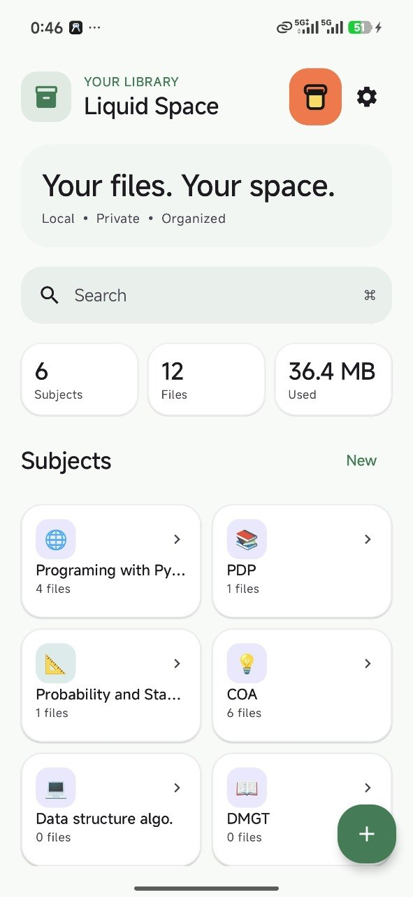
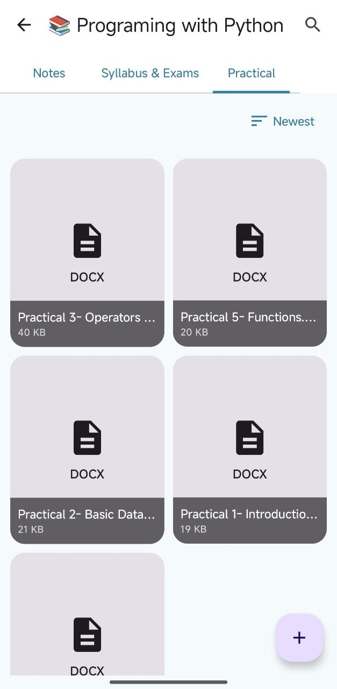
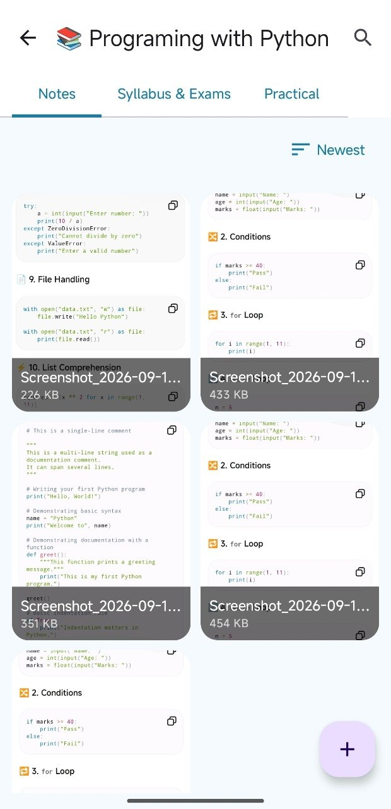
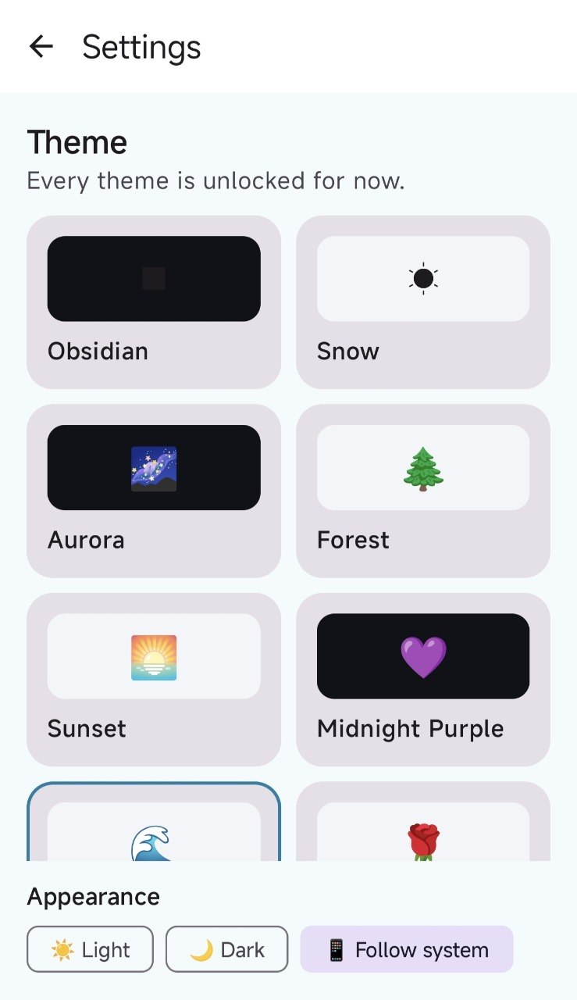
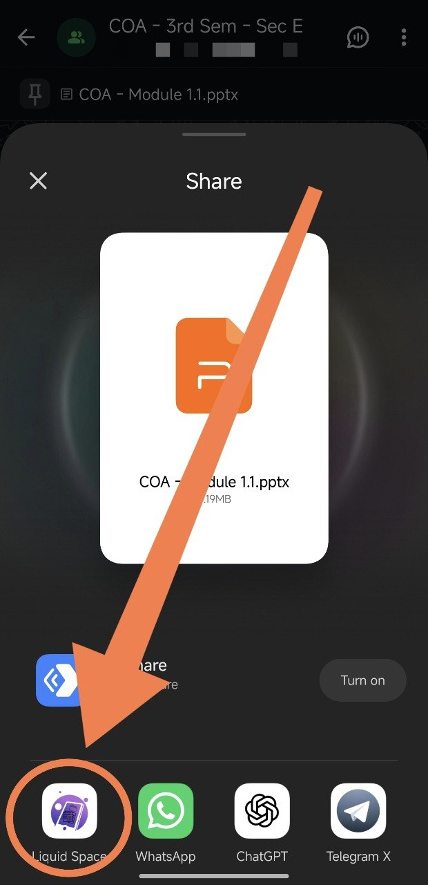
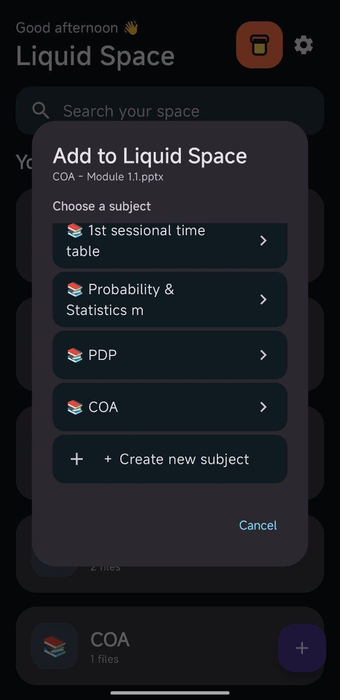
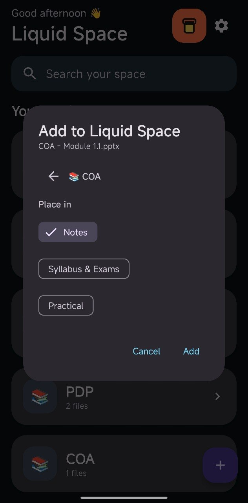

# Liquid Space 3.0.3

> **Your Notes. Your Space. Your Device.** 📚

Liquid Space is a premium, local-first student document organizer for Android. Organize notes, syllabus, exams, practical files, images, and documents by subject while keeping your data on your device.

## ✨ Features

- 📚 Create and manage subjects
- 📝 Notes
- 🎓 Syllabus & Exams
- 🧪 Practical
- 🖼️ Gallery-style image previews
- 📄 Document cards with filename and size
- 📥 Multiple-file import
- 📤 Share files into and out of Liquid Space
- 🔎 Global search
- 🌗 Light, Dark and System appearance
- 🎨 Multiple visual themes
- 🗑️ Long-press subject deletion with confirmation
- 🔐 Local-first storage
- 💳 Razorpay support button with custom-amount payment page
- ⭐ Favorites, recent files, trash and restore
- 📦 ZIP/PDF export with configurable PDF names
- 📤 Normal sharing sends original files without re-encoding or watermarking
- 🔒 Biometric/app lock and private folders
- ⚡ Optimized bitmap previews with bounded memory caching
- 💾 Debounced background persistence to keep UI interactions responsive

## 📸 Screenshots

### Home

  

### Subject & Gallery

  
  

### Themes

  

### Share & Import

  
  
  

## 🔐 Local-first

Liquid Space stores imported documents locally on the device. Core organization does not require cloud storage or an account.

> **Your notes. Your space. Your device.**

## 🛠️ Tech Stack

- Kotlin
- Jetpack Compose
- Material 3
- Android Storage APIs
- App-private local storage
- External Razorpay payment page for secure support contributions

## ⚡ Performance & compatibility

Liquid Space targets Android 8.0+ (API 26+) and is designed to stay responsive across low-RAM and high-end devices. The 6.2 release adds a byte-bounded bitmap cache, sampled image decoding, reduced-resolution previews on low-RAM devices, debounced persistence, background file/export work, and an R8/resource-shrunk release build.

## 🚀 Roadmap

- [ ] Room database
- [ ] Advanced search
- [ ] Favorites
- [ ] Recent files
- [ ] Trash / restore
- [ ] Custom folders
- [ ] Better document previews
- [ ] Backup & restore
- [ ] App lock / biometric protection
- [ ] Liquid Space Pro
- [ ] AI study tools

## Liquid Space 3.0 — Premium Workspace Update

### Home redesign
- Removed the confusing “Good evening Liquid Space” greeting.
- Replaced it with a compact **LOCAL SPACE** identity.
- Added at-a-glance Subjects, Files and Storage statistics.
- Cleaner subject section with a lightweight Add action.
- Recently opened documents are surfaced separately from Favorites.
- Premium spacing, cards and visual hierarchy are preserved.

### Subject management
- Long-press a subject for actions.
- Edit subject name.
- Choose a custom subject emoji/icon.
- Choose a custom accent color.
- Move subjects up/down to reorder the home screen.
- Permanently delete a subject and its local files.

### File management
- Multiple-file import.
- Gallery previews for images.
- Full-screen image gallery.
- Rename, details, move and share.
- Long-press multi-select.
- Bulk share, move and delete.
- Favorites.
- Trash with restore/permanent deletion.
- Custom folders.
- Sort by newest, oldest, name or size.
- Recently opened files.

### Privacy & backup
- Local app-private document storage.
- Optional biometric/device-credential app lock.
- Private folders.
- Local backup export/import.
- Privacy dashboard.

### Support
- Razorpay support action is available from the home header and Settings; users can contribute any amount through the hosted payment page.

## Liquid Space 4.0 — Sharing & Motion Update

### Sharing
- Multi-select sharing now opens a sharing menu.
- Share selected files individually.
- Share selected files as a single ZIP.
- ZIP archives watermark image/PDF content for free users and include a Liquid Space sharing notice.
- Create a combined PDF from images, text files, and existing PDFs.
- Existing PDFs are rendered into a new PDF when watermarking is required.
- Free sharing always applies a subtle transparent diagonal “Shared from Liquid Space” watermark to supported image/PDF output.
- Premium builds can toggle the watermark on/off before sharing.

### Premium entitlement
`BuildConfig.PREMIUM_BUILD` is the entitlement hook. The shipped build keeps it `false` for the free tier. A production Premium build can set it to `true`; this separates the sharing entitlement from the UI and does not falsely grant Premium access to free users.

### Home motion
- “Liquid Space” now uses a looping decrypt/scramble/glitch-style text reveal.
- Characters resolve from random symbols into the final title, then replay after a short pause.

## Liquid Space 5.0 — Sharing Stability & Home Identity

- Home title now resolves to **Your Space** with the existing scramble/decrypt animation.
- Multiple-file sharing is processed away from the main UI thread.
- Removed the extra `ClipData` construction from multi-file sharing to improve OEM/Android share-sheet compatibility.
- ZIP and PDF creation now run in the background.
- Added animated progress/loading UI while files are being prepared.
- Large image/PDF processing is downscaled where appropriate to reduce memory pressure.
- Sharing failures now surface a user-friendly message instead of silently crashing.
- ZIP/PDF watermark rules from 4.0 remain unchanged.

## Liquid Space 5.1 — Build & Sharing Fix

- Added the missing Kotlin Coroutines `launch` import.
- Added explicit Lifecycle Runtime KTX and Coroutines Android dependencies.
- Corrected the background sharing job to use a proper `suspend` work/progress contract.
- Added the missing PDF watermark renderer.
- ZIP/PDF generation remains off the main thread.
- Animated progress UI remains active while sharing work is running.

## Liquid Space 6.0 — Premium Minimal UI

### Home redesign
- Replaced the dense dashboard with a minimal library-first layout.
- New compact brand header and animated rotating typewriter headline.
- Search is simplified to a clean command-style pill.
- Subjects use a compact 2-column library grid.
- Added lightweight stats for Subjects, Files and Used storage.
- Recent and Favorites remain as visual galleries.
- Empty state guides first-time users without clutter.

### Whole-app theme system
Themes now control more than the background:
- Material color scheme
- Typography hierarchy and letter spacing
- Global Material shapes
- Card/control/tile corner radii
- Card elevation
- Border treatment
- Theme-specific compact/soft/glow visual personality
- Theme selector now renders a miniature preview of the actual app UI instead of a simple color swatch.

Theme preview cards update for Light/Dark/System appearance so users can see the complete visual treatment before applying it.

## Liquid Space 6.1 — Sharing & PDF Naming

### Share normally
- Normal sharing now sends the original local files directly.
- No watermark is added.
- No conversion or re-encoding is performed.
- This applies to single and multiple-file normal sharing.

### Make PDF
- Selecting **Make PDF** first opens a PDF naming dialog.
- A suggested filename is generated from the selected subject.
- Example: selecting files from `Computer Networks` suggests `Computer Networks Notes.pdf`.
- If multiple subjects are selected, a compact combined name is suggested.
- The user can edit the filename before creating the PDF.
- Invalid filename characters are sanitized automatically.
- `.pdf` is appended by Liquid Space.
- Existing PDF/image/text conversion and watermark rules remain unchanged.

## Liquid Space 6.2.3 — Home Performance Polish
- Fixed the Home page subject-grid height calculation so the final subject row cannot be covered by the Recent section.
- Removed the artificial subject-grid height cap that could clip large libraries.
- Reduced repeated document traversal on Home by deriving stable visible-document snapshots and per-subject file counts.
- Kept Recent/Favorites derivations stable to reduce unnecessary work during scrolling.
- Added lightweight item visual transitions while preserving the existing Material interactions.
